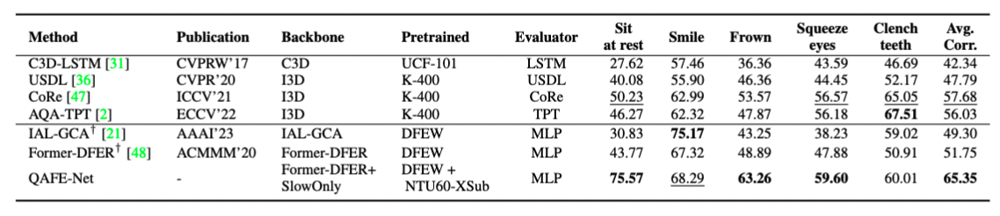

# QAFE-Net

This is the PyTorch implementation for QAFE-Net: Quality Assessment of Facial Expressions with Landmark Heatmaps
[arXiv version]()

We propose a novel landmark-guided approach, QAFE-Net, that combines temporal landmark heatmaps with RGB data to capture small facial muscle movements that are encoded and mapped to severity scores.
 

## PFED5 Dataset


PFED5 is a Parkinson’s disease (PD) dataset for facial expression quality assessment. Videos were recorded using a single RGB camera from 41 PD patients performed five different facial expressions including sit at rest, smile, frown, squeeze eyes tightly, and clench teeth in clinical settings. The trained rater assigned a score for each expression, based on the protocols of MDS-UPDRS, varying between 0 and 4 depending on the level of severity. 

## Get Started
### Requirements
pytroch >= 1.3.0, tensorboardX, cv2, scipy, einops, [torch_videovision](https://github.com/hassony2/torch_videovision)

### Data Preparation

-1: Download PFED5 dataset. To access the PFED5 dataset, please complete and sign the [PFED5 request form](dataset/PFED5_Request_Form.docx) and forward it to shuchao.duan@bristol.ac.uk. By submitting your application, you acknowledge and confirm that you have read and understood the relevant notice. Upon receiving your request, we will promptly respond with the necessary link and guidelines.

-2: We adopt SCRFD from [InsightFace](https://insightface.ai) for face detection and landmark estimation,
and [Albumentation library](https://albumentations.ai) for normalising the landmark positions to cropped face regions.

-3: Generate landmark heatmaps for corresponding video clips.

### Training and Testing on PFED5
run ```python main_PFED5.py --gpu 0,1 --batch_size 4 --epoch 100```

### Pretrained Weights
Download pretrain weights (RGB encoder and heatmap encoder) from [here](https://github.com/shuchaoduan/QAFE-Net/models/pretrain). Put entire `pretrain` folder under `models` folder.

	```
	- models/pretrain/
		 FormerDFER-DFEWset1-model_best.pth
		 pose_only.pth
	```

 ### Evaluation Results
 Comparative Spearman's Rank Correlation results of QAFE-Net with SOTA AQA methods on PFED5


## Citations
If you find our work useful in your research, please consider giving it a star ⭐ and citing our paper in your work:

```bibtex

```

## Acknowlegement
We would like to gratefully acknowledge the contribution of the Parkinson’s study participants. The clinical trial from which the video data of the people with Parkinson’s was sourced was funded by Parkinson’s UK (Grant J-1102), with support from Cure Parkinson’s. Our implementation and experiments are built on top of [Former-DFER](https://github.com/zengqunzhao/Former-DFER). We thank the authors who made their code public, which tremendously accelerates our project progress. 


